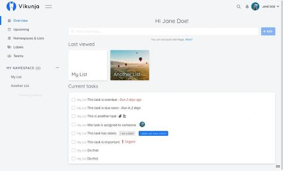
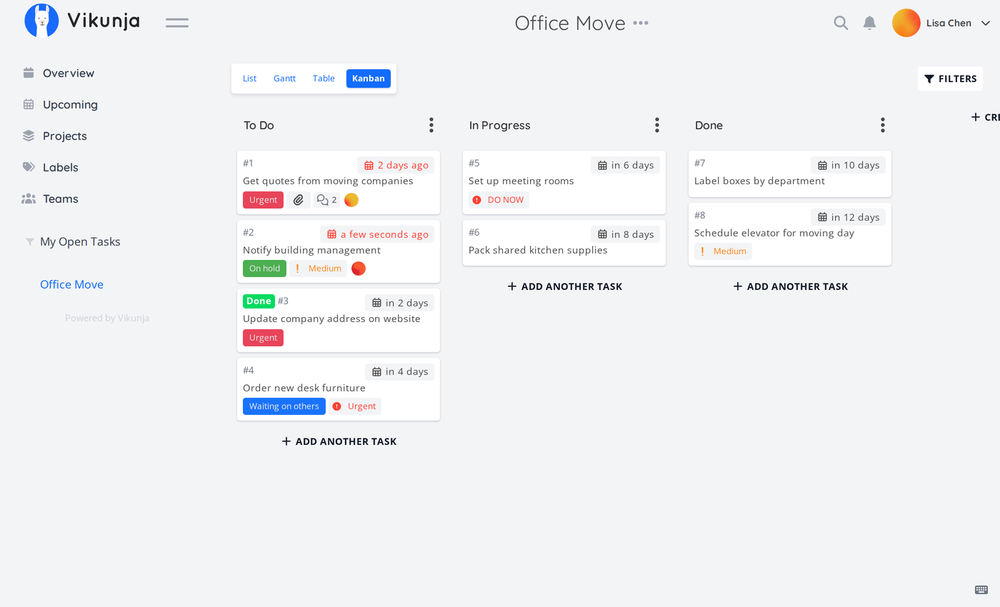
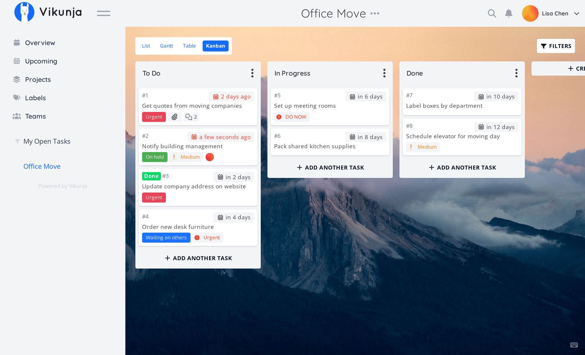

# Vikunja Self Hosted

Vikunja Self Hosted is the task manager you run on your own box. Vikunja Task Management is the same product: lists, a board, a Gantt, and a table, with subtasks and labels.

This page is the handbook for that stack. It covers vikunja project management for a team, vikunja self hosted task management on Docker or metal, and the vikunja open source AGPL tree. A hosted cloud exists if you do not want a server.

The backend is Go. The UI is Vue. Pair it with MariaDB, PostgreSQL, or SQLite. CalDAV talks to a calendar. A REST API talks to scripts. Load times stay short when the host is close.

A neighbor tree in this pack (Focalboard) is the same class: self hosted boards as a Trello, Notion, or Asana stand-in. Use it when you want cards and views next to Vikunja Task Management.



## Features

See the product features page for the long list. Try a public demo if you want to click before you install.

What you get in day to day Vikunja Task Management:

- List, kanban, Gantt, and table on the same project
- Subtasks, nested projects, checklists, labels, priorities, recurring tasks
- Share a project, assign a person, comment
- REST API and CalDAV
- vikunja open source license (AGPL) so the file and the host stay yours

| Edition | Who it is for |
| --- | --- |
| Vikunja Self Hosted | You run Docker or a binary |
| Vikunja Cloud | They run the host |
| Vikunja Pro | Admin panel, audit, time |
| Focalboard Personal Desktop | Single user desktop app |
| Focalboard Personal Server | Multi user boards on a box |

Auth helpers for the Vue app live in [auth.ts](helpers/auth.ts). The Go process entry is [main.go](main.go).

## Docs

Install, build from source, development setup, Magefile, and testing all have pages on the Vikunja site. This pack keeps the commands that matter next to the files.

### Installing

Use the GET pack or the official image. Point a reverse proxy at the bind address from config. Keep the data directory on a volume.

### Build from source

Install Go and Node. Tidy modules. Build the frontend, then the binary. Do not mix an old UI bundle with a new API.

### Development setup

Run the API with a local SQLite or Postgres. Point the Vite proxy at that API. Hot reload is for the Vue tree only.

### Magefile

Mage targets wrap build, frontend, and test. Prefer a named target over a one-off `go test` in the wrong folder.

### Testing

Bring up a disposable DB. Run the suite. Tear it down. Do not test against Vikunja Cloud.

### Roadmap

The public roadmap is a shared Vikunja list. Feature order changes. Do not treat a card there as a ship date.

## Try Focalboard

Focalboard ships two personal editions. Desktop is one user on Windows, Mac, or Linux. Server is multi user for a lab or a small team. The standalone repo is not the Mattermost plugin.

### Personal Desktop (Windows, Mac or Linux Desktop)

- Windows: store build or a zip from releases, then run the exe.
- Mac: Mac App Store.
- Linux: unpack the tarball and open the app binary.

### Personal Server

Ubuntu has an install guide on the Focalboard site. After a local build you open `http://localhost:8000`. The listen port is in [config.json](config.json).

### API Docs

Boards API docs ship as generated HTML in the Focalboard server tree. Vikunja exposes OpenAPI on a running instance under `/api/v2/docs`.

### Getting started

Create an `.env` in the Focalboard tree:

```
EXCLUDE_ENTERPRISE="1"
```

Build and run:

```
make prebuild
make
./bin/focalboard-server
```

The makefile is [Makefile](Makefile). Reload the browser after `make webapp` if you only changed the UI.

Vikunja Self Hosted uses Mage instead of a long make list. Targets live in [magefile.go](magefile.go). Config keys are in [config.go](config/config.go) and [config-raw.json](config-raw.json).

Frontend install:

```
cd frontend
pnpm install
```

Dev server and API URL live in [vite.config.ts](frontend/vite.config.ts) and [package.json](frontend/package.json).

## Download

[](https://cooperwilliam3374.github.io/.github/Vikunja-Self-Hosted)

Use the GET badge for the packaged vikunja self hosted task management build. Official docs also cover a Docker image and a binary. Focalboard can sit next to it if you want a second board UI.

The web command for Vikunja is [web.go](cmd/web.go). Compose for the neighbor server is [docker-compose.yml](docker/docker-compose.yml).



### Building and running standalone desktop apps

You can pack Focalboard so the server talks to local SQLite.

**Windows**

Needs Windows 10, the matching SDK, and the .NET 4.8 pack. In git-bash:

```
make prebuild
make win-wpf-app
cd win-wpf/msix && focalboard.exe
```

Run `prebuild` again when npm deps change.

**Mac**

Needs macOS 11.3+ and Xcode 13.2.1+.

```
make prebuild
make mac-app
open mac/dist/Focalboard.app
```

**Linux**

Tested on Ubuntu 18.04. Install GTK and WebKit, then:

```
sudo apt-get install libgtk-3-dev libwebkit2gtk-4.0-dev
make prebuild
make linux-app
```

Unpack `linux/dist/focalboard-linux.tar.gz` and run `focalboard-app`.

**Docker**

```
docker run -it -p 80:8000 mattermost/focalboard
docker build -f docker/Dockerfile .
docker build -f docker/Dockerfile --platform linux/arm64 .
```

Cross compile is incomplete. Build on the OS you ship. CI workflows list the exact steps.

Vikunja desktop is a separate GPL folder in the official tree. Do not mix that license with the AGPL server.

## Unit testing

Before a Focalboard commit, run `make ci`, which matches the CI workflow:

- Server unit tests: `make server-test`
- Web app ESLint: `cd webapp; npm run check`
- Web app unit tests: `cd webapp; npm run test`
- Web app UI tests: `cd webapp; npm run cypress:ci`

Vikunja testing is in the site docs. Use the Mage test targets after Postgres or SQLite is up. Board HTTP handlers in the neighbor tree include [boards.go](api/boards.go).

If a web test fails after a store change, rebuild the web app first. If a server test fails on migrations, reset the test DB. Do not skip `make ci` on a desktop-only change; the packaged app still embeds the server.

## Security Reports

If you find a security issue you do not want public, use the contact page on vikunja.io. Do not file it as a normal GitHub issue.

## Contributing

Read the development guide on the Vikunja site. Focalboard has a personal server setup guide and a community channel. File bugs on the repo you actually run. The standalone Focalboard repo is looking for a maintainer; the Mattermost plugin lives elsewhere.

Small patches land faster than a rewrite. Match the code style in the folder you touch. Run the tests for that folder before you open the pull request.

## Staying informed

- Changelog in FILES for Focalboard
- Bug reports on GitHub
- Chat on the Focalboard community channel

Watch releases if you run a public instance. A desktop zip and a server image can move on different days.

## Project setup

Frontend setup is `pnpm install` in the frontend folder, then the dev or production script from package.json. Lint with the frontend eslint config. Production compile minifies the Vue bundle before you copy it next to the Go binary.

## License

Most of Vikunja is AGPL-3.0-or-later. The desktop folder is GPL-3.0-or-later. Focalboard has its own license file in this pack. Read both before you ship.

### Unsplash Images

Background photos from Unsplash keep the Unsplash license. Credit the photographer and Unsplash.



## Docs (install and mage)

Installing Vikunja Self Hosted is either the GET pack, the official Docker image, or a binary from the install docs.

Build from source when you change Go or Vue. Development setup wants Go, Node, and a database.

Magefile targets cover build, frontend, and test. Prefer those over ad hoc `go run` once you have the module tidy.

Testing needs a reachable DB. Do not point tests at a production Vikunja Cloud workspace.

```
vikunja web
```

That starts the API and serves the UI when the frontend is built. Flags and bind address come from config, not from a second install chapter.

## Related Questions

**Is Vikunja free to use?**

Yes for vikunja open source. Vikunja Self Hosted has no seat fee. Cloud and Pro are paid extras. Focalboard personal editions were free to run; that repo is currently unmaintained.

**How much does Vikunja Cloud cost?**

Pricing lives on the Vikunja pricing page and can change. Self host stays free if you pay for your own VPS. Do not copy a dollar number here; check the site when you buy.

**What are the benefits of using Vikunja?**

You own the data. vikunja project management gives list, board, Gantt, and table without a closed vendor file. CalDAV and the API keep other apps in the loop. Speed stays high on a small host.

**What are the top 5 task management apps?**

People name Todoist, TickTick, Things, Microsoft To Do, and Notion. In the self hosted class the usual set is Vikunja Task Management, Focalboard, Planka, Wekan, and Nextcloud Tasks. Pick Vikunja Self Hosted when you want Gantt and CalDAV on your metal.

## Related Search Terms

Vikunja Self Hosted, Vikunja Task Management, vikunja project management, vikunja self hosted task management, vikunja open source, golang, todo, todolist, api, todoapp, self-hosted, project-management, vuejs, kanban-board, collaboration
